# Real-Time News Trend & Sentiment Analysis Platform

## 1. Problem Statement
This project develops a **real-time global news trend and sentiment analytics system** that continuously ingests and processes online news streams from publishers such as **Reuters**, **The Irish Times**, and **The Wall Street Journal**.  
The platform supports both **historical batch analysis** and **real-time stream analytics** to answer critical questions like:

- What global topics are trending right now?  
- How is public sentiment evolving around key themes (e.g., elections, markets, disasters)?  
- Which regions or publishers show the strongest sentiment shifts?

## 2. System Scope

### 2.1 Objectives
- Real-time ingestion of global news feeds via APIs/RSS  
- Stream processing for trending topics & sentiment detection  
- Historical batch processing for long-term trend discovery  
- Distributed data storage in HDFS and NoSQL databases  
- Visualization dashboard for interactive insights  

### 2.2 Limitations
- Dependent on external API rate limits and feed availability  
- Focused primarily on English-language publishers  
- Predictive modeling (e.g., trend forecasting) is future work  

## 3. System Architecture
We adopt a **Lambda Architecture**, combining **batch processing** for historical analytics with **streaming processing** for low-latency insights.  
This hybrid approach ensures both accuracy and freshness in analytics.

### 3.1 Architectural Overview

1. **Data Ingestion Layer** → Collects live news via APIs and streams to Kafka topics  
2. **Speed Layer** → Spark Structured Streaming performs near-real-time sentiment & topic aggregation  
3. **Batch Layer** → Spark Batch jobs process and store large-scale historical data in HDFS  
4. **Storage Layer** → Cassandra(hot data), HDFS (cold data)  
5. **Query Layer** → Presto enables unified SQL access across data stores  
6. **Visualization Layer** → Dashboards (Grafana/Kibana/React) present insights interactively  
7. **Deployment Layer** → Kubernetes orchestrates scalable, fault-tolerant microservices  

### 3.2 Component Responsibilities

| Component | Technology Stack| Core Function |
|--------------|----------------|--------|
| **Data Source** | Reuters, WSJ, Irish Times APIs | Provide global live news streams |
| **Ingestion** | Apache Kafka | Streams data into topics `news_raw`, `news_processed` |
| **Batch Layer** | Apache Spark (Batch) + HDFS | Historical sentiment modeling and topic detection |
| **Speed Layer** | Spark Structured Streaming | Real-time trend and sentiment updates |
| **Storage (Hot)** | Cassandra | Stores latest processed results for dashboards |
| **Storage (Cold)** | HDFS | Archives all raw and processed data |
| **Query Layer** | Presto | Unified SQL queries across batch and real-time data |
| **Visualization** | Grafana / Kibana / React | Dashboards showing sentiment and topic evolution |
| **Deployment** | Kubernetes | Container orchestration and scalability |

### 3.3 Data Flow

  

### 4. Advantages

* Unified Lambda Architecture for historical and real-time analytics
* Scalable ingestion from multiple news publishers
* Low-latency detection of emerging topics and sentiments
* Modular and containerized design for deployment flexibility