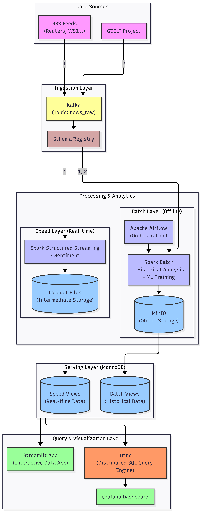

# News Trend & Sentiment Analysis Pipeline - Lambda Architecture

A production-ready big data analytics pipeline implementing **Lambda Architecture** to analyze **real-time news trends** combined with **historical data from GDELT** for sentiment tracking, topic classification, and unified market intelligence.

## 📋 Table of Contents

- [Quick Start](#-quick-start)
- [Project Overview](#-project-overview)
- [Lambda Architecture Layer Contributions](#-lambda-architecture-layer-contributions)
- [Architecture](#-architecture)
- [Technology Stack](#-technology-stack)
- [Core Features](#-core-features)
- [Project Structure](#-project-structure)
- [Deployment](#-deployment)
- [Monitoring & Operations](#-monitoring--operations)

## 🎯 Project Overview

### Business Goals

1. **Real-time Sentiment Monitoring (PR Crisis Detection)**
   - **Business Need**: Organizations need immediate awareness of sentiment shifts in news coverage to manage PR crises.
   - **Solution**: Detect sudden deviations in sentiment scores (e.g., from +0.4 to -0.2) within minutes using streaming analytics.
   - **Value**: Enable rapid response to negative press by identifying statistically significant sentiment drops before they escalate.
   - **Example**: Alert PR teams when "Company X" sentiment drops below -0.1, indicating an emerging controversy.

2. **Trend Detection & Category Classification**
   - **Business Need**: Analysts struggle to identify trending topics manually amidst millions of daily articles.
   - **Solution**: Compute "burstiness" metrics and trend indicators by comparing real-time article volumes against historical baselines.
   - **Value**: Automate the discovery of emerging outcomes in sectors like Technology, Finance, or Politics.
   - **Example**: Detect a 300% surge in "AI Regulation" articles compared to the weekly average.

3. **Unified Historical & Real-Time Context**
   - **Business Need**: Fragmented insights from separate real-time and archival systems lead to incomplete analysis.
   - **Solution**: Merge fresh RSS data with deep GDELT historical context at query time.
   - **Value**: Provide comprehensive situational awareness that places current events in the context of long-term patterns.
   - **Example**: Compare today's "Election" coverage intensity against the last 5 years of election cycles.

### Data Scope & Characteristics

#### Primary Data Sources

**RSS Feeds (Speed Layer - Real-Time Ingestion)**
- **Data Types**: Article titles, body text, publication timestamps, source metadata.
- **Sources**: Reuters, WSJ, BBC, and other major global publishers.
- **Update Frequency**: 60-second polling (near real-time).
- **Retention**: Last 3 days in Speed Layer (MongoDB TTL).
- **Real-Time Nature**: Continuous ingestion enabling sub-minute latency for alerts.
- **Current Status**: ✅ **OPERATIONAL** - Continuous polling active.

**GDELT Project API (Batch Layer - Historical Context)**
- **Data Types**: Global event data, historical news URLs, tone scores, relationships.
- **Volume**: Massive historical archives for trend baseline calculation.
- **Update Frequency**: Daily scheduled batch ingestion.
- **Purpose**:
  - **Batch Layer**: Calculate long-term sentiment baselines, train ML classifiers, and build source-entity graphs.
- **Current Status**: ✅ **INTEGRATED** - Batch scheduled via Airflow.

#### Data Flow Strategy

- **Speed Layer Focus**: Processing RSS feeds with Spark Structured Streaming for immediate sentiment and keyword extraction (last 72 hours).
- **Batch Layer Focus**: Processing GDELT + RSS archives with Spark Batch for deep NLP, ML classification, and Graph analytics.
- **Merge Strategy**: Query-time merge with 3-day cutoff - recent Speed data + historical Batch data.
- **Lambda Architecture Justification**: RSS feeds provide high-velocity signals; GDELT provides the massive volume needed for statistical significance.

## 🧩 Lambda Architecture Layer Contributions

This section details how each layer of the Lambda Architecture contributes to solving the three business problems.

### Business Problem #1: Real-Time Sentiment Monitoring

**Goal**: Detect sentiment shifts and crises by comparing real-time RSS news against historical baselines.

#### Speed Layer Contribution (RSS Streaming)
**What it processes:**
- Real-time RSS feeds (Reuters, WSJ, etc.)
- Live sentiment analysis using keyword-based scoring (VADER-like)
- Keyword extraction (Top-5 distinguishing terms)

**Output:**
- Current sentiment score (e.g., +0.45 for "Tech Sector")
- Immediate sentiment shifts per category
- Real-time article volume by source

**Limitation**: Uses lightweight keyword dictionaries for speed; lacks deep semantic understanding.

#### Batch Layer Contribution (History & Training)
**What it processes:**
- Full historical archives (RSS + GDELT)
- Advanced NLP enrichment and MLlib Logistic Regression
- Source credibility analysis via PageRank

**Output:**
- Trained ML models for accurate classification
- Historical sentiment baselines per category
- Entity-Source influence graphs

**Limitation**: Daily refresh cycle; cannot catch breaking news instantly.

#### Merged Result (Serving Layer)
**Combined Intelligence:**
```
Query: "Is there a negative trend in Finance news?"

Speed Layer: Current sentiment -0.3 (dropped from +0.1 in last hour)
Batch Layer: Historical Finance baseline +0.15, typical variance ±0.1

Merged Answer:
✅ ALERT: Negative Trend Detected
- Current -0.3 is significantly below baseline (+0.15)
- Drop exceeds normal variance
- Recommendation: Investigate recent "Market Crash" keywords
```

---

### Business Problem #2: Trend Detection & Classification

**Goal**: Identify breakout topics by comparing real-time volume against historical averages.

#### Speed Layer Contribution
**What it processes:**
- Article arrival velocity (articles/hour)
- Heuristic-based category tagging
- Emerging keyword frequency

**Output:**
- Current volume: "150 articles/hour in Technology"
- Verification of new, unseen keywords

**Limitation**: Cannot determine "burstiness" without a long-term mean.

#### Batch Layer Contribution
**What it processes:**
- Rolling window statistics (Mean, Standard Deviation)
- Burstiness coefficient calculation ($\sigma / \mu$)
- Temporal trend analysis (Seasonality)

**Output:**
- Category baselines: "Technology averages 40 articles/hour"
- Trend Thresholds: "Variability > 2.0 indicates viral event"

**Limitation**: Historical trends don't capture the "now".

#### Merged Result (Serving Layer)
**Combined Intelligence:**
```
Query: "Is 'AI Regulation' trending?"

Speed Layer: 150 articles/hour, keywords: "Senate", "AI", "Law"
Batch Layer: Baseline volume 40/hour, Threshold for 'Trending' is 100/hour

Merged Answer:
✅ TRENDING TOPIC CONFIRMED
- Current volume (150/h) > Trending Threshold (100/h)
- Burstiness verified against historical stability
- Action: Highlight in "Trending Now" dashboard section
```

---

### Summary: Why Both Layers Are Essential

| **Layer** | **Contribution** | **Limitation Without Other Layer** |
|-----------|------------------|-------------------------------------|
| **Speed Layer (RSS)** | Low-latency alerts, real-time volume, fresh content | No statistical context; prone to noise |
| **Batch Layer (GDELT)** | Deep learning (ML), GraphRank, Statistical Baselines | High latency; blind to the last 24 hours |
| **Merged (Serving)** | Contextualized real-time insights | — |

## 🏗️ Architecture



### Lambda Architecture Components

**Batch Layer**: Manages the master dataset and computes comprehensive views.
- **Orchestration**: Airflow DAG `news_crawler_dag` runs daily at 6 PM.
- **Processing**: Spark jobs for ML classification, PageRank (Source Authority), and time-series baselines.
- **Storage**: MinIO (Parquet) for archival, MongoDB `news_analytics` for serving.

**Speed Layer**: Handles low-latency processing of live data.
- **Ingestion**: Kafka `news_raw` topic with Avro serialization.
- **Processing**: Spark Structured Streaming (`streaming_pipeline.py`) for sentiment and heuristics.
- **Storage**: MongoDB `news_rt` with 3-day TTL.

**Serving Layer**: Unifies views for the end-user.
- **Interface**: Streamlit Dashboard for interactive exploration.
- **Monitoring**: Grafana (via Trino) for system health and operational metrics.
- **Strategy**: Merges data with a 3-day cutoff preference (Speed > Batch).

## 🛠️ Technology Stack

### Batch Layer Technologies

| Component | Technology | Purpose |
|-----------|-----------|---------|
| **Orchestration** | Apache Airflow | Schedule daily pipelines & dependency management |
| **Processing** | Apache Spark (Batch) | ML training, Graph Analytics, NLP enrichment |
| **Storage** | MinIO (S3 Compatible) | Data Lake storage (Bronze/Silver/Gold Parquet) |
| **Data Source** | GDELT & RSS | Historical event data and articles |

### Speed Layer Technologies

| Component | Technology | Purpose |
|-----------|-----------|---------|
| **Streaming** | Apache Kafka | Message bus for decoupling producers/consumers |
| **Processing** | Spark Struct. Streaming | Real-time sentiment & keyword extraction |
| **Serialization** | Confluent Avro | Schema enforcement and evolution |
| **Storage** | MongoDB | Hot storage for real-time views |

### Serving Layer Technologies

| Component | Technology | Purpose |
|-----------|-----------|---------|
| **Database** | MongoDB | Unified document store for Batch & Speed views |
| **Interface** | Streamlit | Interactive Python-based data dashboard |
| **Analytics SQL** | Trino | Distributed SQL engine for querying MongoDB |
| **Monitoring** | Grafana | Operational dashboards and alerts |

### Infrastructure

| Component | Technology | Purpose |
|-----------|-----------|---------|
| **Orchestration** | Kubernetes (K8s) | Container orchestration for all services |
| **Registry** | Docker Hub | Container image repository |
| **Dev Env** | Minikube | Local Kubernetes development cluster |

## 🎨 Core Features

### Real-Time Analytics
- **Live Sentiment Scoring**: Immediate VADER-based scoring of incoming RSS articles.
- **Keyword Extraction**: Top-5 keywords extracted per article for instant topic tagging.
- **Velocity Tracking**: Monitor article arrival rates per category in real-time.

### Historical Intelligence
- **ML Classification**: Logistic Regression models trained on historical data for high-accuracy categorization.
- **Source Authority**: PageRank analysis on Source-Entity graphs to identify influential publishers.
- **Trend Baselines**: Rolling window statistics (Mean, StdDev) to define "normal" activity levels.

### Visualization & Query
- **Streamlit Dashboard**:
  - Sentiment Distribution Pie Charts
  - Trending Keywords Treemaps
  - Real-time News Feed with filtering
- **Grafana Monitoring**:
  - System health (Kafka lag, Spark persistence)
  - Operational metrics (Processing rate)

## 📁 Project Structure

```
news-trend-and-sentiment-analysis/
├── README.md                          # This file
├── crawler/                           # Ingestion Layer
│   ├── news_crawler.py                # RSS Crawler (Stream/Batch modes)
│   ├── historical_crawler.py          # GDELT Crawler
│   ├── config.py                      # Crawler configurations
│   └── feeds_extended.yaml            # RSS Source definitions
│
├── jobs/                              # Processing Layer
│   ├── streaming/                     # Speed Layer
│   │   ├── streaming_pipeline.py      # Spark Structured Streaming job
│   │   └── alert_consumer.py          # Anomaly detection consumer
│   ├── batch/                         # Batch Layer
│   │   └── batch_pipeline.py          # Historical NLP processing
│   ├── analytics/                     # Advanced Analytics
│   │   ├── ml_pipeline.py             # Classification Model Training
│   │   ├── graph_analytics.py         # GraphFrames PageRank
│   │   └── advanced_aggregations.py   # Integrated Analytics Job
│   └── config/                        # Job configurations
│
├── airflow/                           # Orchestration
│   └── dags/
│       └── news_crawler_dag.py        # Main Batch Pipeline DAG
│
├── dashboard/                         # Serving Layer
│   ├── app.py                         # Streamlit Application
│   └── Dockerfile                     # Dashboard container
│
├── k8s/                               # Deployment
│   ├── 01-kafka.yaml                  # Infrastructure
│   ├── 02-mongodb.yaml
│   ├── 03-spark.yaml
│   ├── 07-crawler.yaml                # Workloads
│   ├── 08-streamlit.yaml
│   └── ... (22 manifests total)
│
└── schemas/                           # Data Governance
    └── news_raw.avsc                  # Avro Schema for Kafka
```

## 🚀 Quick Start

### Prerequisites

- **Docker Desktop** (with Kubernetes enabled) or **Minikube**
- **Python 3.11+**
- **Helm** (optional, for some dependency management)

### Architecture Setup (Local K8s)

1.  **Start Minikube**
    ```bash
    minikube start --cpus=4 --memory=8192 --driver=docker
    ```

2.  **Deploy Namespace & Infrastructure**
    ```bash
    kubectl apply -f k8s/00-namespace.yaml
    kubectl apply -f k8s/01-kafka.yaml
    kubectl apply -f k8s/02-mongodb.yaml
    # Wait for pods to be ready
    ```

3.  **Deploy Application Workloads**
    ```bash
    kubectl apply -f k8s/07-crawler.yaml
    kubectl apply -f k8s/08-streamlit.yaml
    ```

4.  **Access the Dashboard**
    ```bash
    kubectl port-forward -n news-pipeline service/streamlit-service 8501:8501
    # Open http://localhost:8501 per instructions
    ```

## 📊 Monitoring & Operations

- **Streamlit Dashboard**: `http://localhost:8501` - Business Intelligence
- **Grafana**: `http://localhost:3000` - System Health
- **Airflow**: `http://localhost:8080` - Batch Job Scheduling
