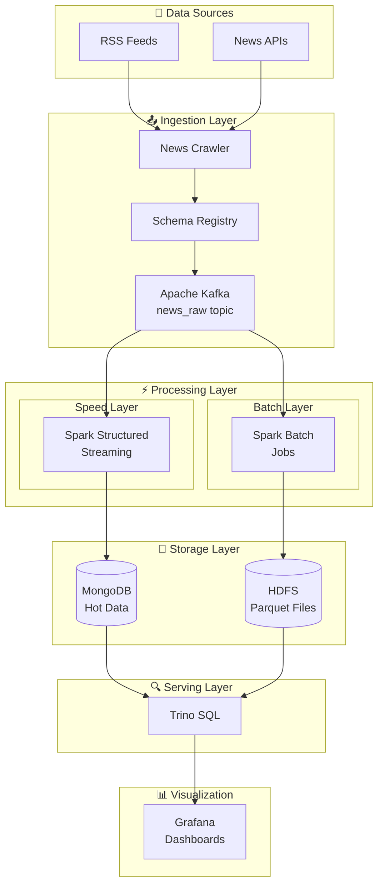
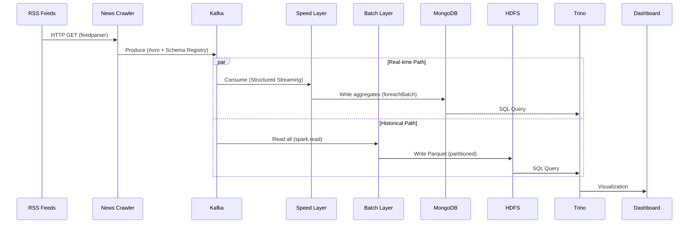
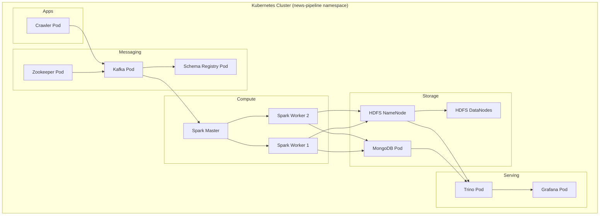

# Architecture Overview

## Lambda Architecture for News Trend & Sentiment Analysis

This document describes the full Lambda Architecture implementation with speed, batch, and serving layers.

---

## High-Level Architecture



---

## Data Flow Diagram



---

## Component Details

### Data Ingestion Layer

| Component       | Technology          | Purpose                           |
| --------------- | ------------------- | --------------------------------- |
| Crawler         | Python + feedparser | Fetch RSS feeds, parse articles   |
| Schema Registry | Confluent           | Avro schema management, evolution |
| Kafka           | Apache Kafka 7.4    | Message queue, news_raw topic     |

**Key Features:**

- Avro serialization with schema versioning
- Content hashing (MD5, simhash64) for deduplication
- Per-source rate limiting

### Speed Layer (Real-time)

| Component     | Technology                 | Purpose                |
| ------------- | -------------------------- | ---------------------- |
| Streaming Job | Spark Structured Streaming | Low-latency processing |
| Hot Storage   | MongoDB                    | Real-time aggregates   |

**Key Features:**

- **Auto-Categorization**: Lightweight UDF for keyword-based topic assignment.
- **Latency**: ~60 seconds end-to-end.
- **Lifecycle**: Automated cleanup of data > 3 days old via Airflow.
- **Output**: `news_rt` database (Trends, Source Sentiment).

### Batch Layer (Historical)

| Component     | Technology         | Purpose                    |
| ------------- | ------------------ | -------------------------- |
| Scheduler     | Apache Airflow 2.7 | Daily Orchestration (6 PM) |
| Batch Job     | Spark Batch        | Historical processing      |
| Cold Storage  | HDFS + Parquet     | Long-term Archive          |
| Serving Store | MongoDB            | Dashboard Integration      |

**Key Features:**

- **Dual-Write Strategy**:
  1.  **Parquet (HDFS)**: Optimized for heavy queries/retraining.
  2.  **MongoDB**: Optimized for Dashboard display (Collections: `historical_articles`).
- **Schedule**: Runs daily at **18:00 (6 PM)**.
- **Logic**: Deduplicates against existing data using content hash.

**Advanced Analytics:**

- MLlib sentiment classification (TF-IDF + LogisticRegression)
- GraphFrames entity analysis (PageRank, connected components)
- Time series analysis (rolling windows, anomaly detection)

### Serving Layer

| Component     | Technology | Purpose               |
| ------------- | ---------- | --------------------- |
| Query Engine  | Trino      | Federated SQL queries |
| Visualization | Grafana    | Real-time dashboards  |

**Key Features:**

- Unified SQL access to MongoDB + HDFS
- Low-latency queries for dashboards
- Historical analysis across all data

---

## Kubernetes Deployment



### ArgoCD CI/CD

GitOps deployment configuration in `argocd/`:

- `application.yaml` - ArgoCD Application with auto-sync and health checks
- `README.md` - Setup and usage instructions

## Data Schema

### news_raw (Kafka Topic)

```json
{
  "article_id": "uuid",
  "source_domain": "reuters.com",
  "title": "Article title",
  "body_text": "Full article content...",
  "published_at": 1705334400000,
  "language": "en",
  "tags": ["economy", "markets"],
  "content_hash_md5": "abc123...",
  "event_time": 1705334400000
}
```

### Processed Schema (Speed Layer Output)

```json
{
  "article_id": "uuid",
  "source_domain": "reuters.com",
  "sentiment": { "label": "pos", "polarity": 0.15 },
  "keywords": [{ "term": "market", "score": 0.25 }],
  "entities": [{ "type": "ORG", "text": "Reuters", "norm": "reuters" }],
  "topics": [{ "topic_id": 42, "score": 0.3 }]
}
```

---

## Performance Considerations

| Aspect              | Configuration                          |
| ------------------- | -------------------------------------- |
| Shuffle Partitions  | 200 (default), AQE adjusts dynamically |
| Broadcast Threshold | 64 MB                                  |
| Watermark           | 30 minutes                             |
| Window Duration     | 10 minutes                             |
| Window Slide        | 5 minutes                              |
| Parquet Compression | Snappy                                 |
| Bucketing           | 16 buckets on source_domain            |

---

## Monitoring

- **Spark UI**: Job progress, DAG visualization, executor metrics
- **Grafana**: Real-time dashboards for trends, sentiment
- **Kafka**: Consumer lag, partition status
- **MongoDB**: Collection stats, query performance

---

## References

- [Apache Spark Documentation](https://spark.apache.org/docs/latest/)
- [Kafka Documentation](https://kafka.apache.org/documentation/)
- [Lambda Architecture](https://www.databricks.com/glossary/lambda-architecture)
- IT4931 Lab Materials (spark-lab, Streaming_Lakehouse_lab)
